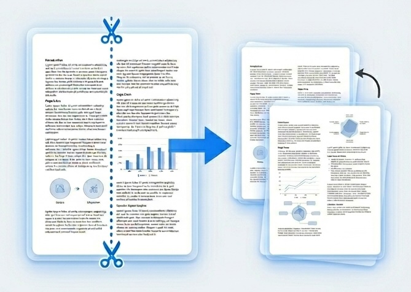
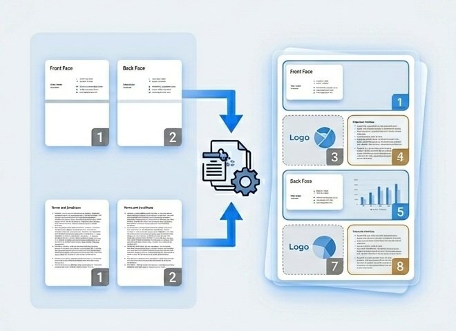

# ととのえPDF

https://kenichi-ando.github.io/pdf-utility/

## 主なユースケース (Use Cases)

- **見開きPDFを1ページずつに整える**  
  A3見開きなどのPDFを、A4相当の1ページずつに分割して扱いやすくする。
- **両面スキャンPDFを読み順にまとめる**  
  表面PDFと裏面PDFを交互に結合し、読み順どおりの1つのPDFにする。
- **学習・業務の配布資料を整理する**  
  試験問題、教材、会議資料など、見開き分割やページ順調整が必要なPDF処理に対応。

## できること (Features)

### 見開き分割 (Split & Combine)

見開きページを2ページに分割。 (Split spread pages into two pages.)

### 交互結合 (Interleave Merge)

表面PDF と 裏面PDF を交互に結合。各PDFの順番指定可。 (Interleave Front and Back PDFs page-by-page with selectable order for each side.)

